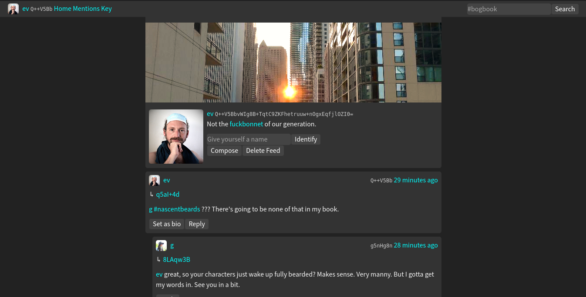

# bogbook v2 spec

### by Everett Bogue



Try it: [bogbook.com](http://bogbook.com/)

So after working on [bogbook](https://git.sr.ht/~ev/bogbook) [git.sr.ht] for a year, and [news](https://git.sr.ht/~ev/news) [git.sr.ht] for a few weeks, I realized that append-only logs are a great way to distribute data and treating messages as seperate makes it really challenging to distribute data.

However, some of the ideas from news are very good, so I want to bring them into bogbook. But that'll mean I'll need to throw out how it worked before, and start over from scratch. If you want to read the code it is [here](https://git.sr.ht/~ev/gossip).

In the meantime, just email me [ev@evbogue.com](mailto:ev@evbogue.com) if you want to talk.

Or join #bogbook on irc.freenode.net to talk to me in a chat format. 

---

## log spec

The aim of bogbook is to be a public gossiped news and photo sharing network where you can apply filters to images. There are no private messages on the log (that became a security issue with ssb), we only encrypt/decrypt messages in transit during replication.

### keypairs

keypairs are ed25519 keypairs, encoded in base64, concatenating the public key to private key

```
<publickey><privatekey>
```  

There can be no '/' characters in the public key, because file systems do not like slashes, so we will throw them out when generating new keypairs. If there is a '/' in an imported keypair, we should error out on import.

### signed messages

signed messages exist on a single line, and consist of a hash of the signature, the public key of an author, and the signature

```
<sha2hash><ed25519 public key><ed25519 signature>
```

### opened messages

when opened, it could look this way:

```
{
  text: <text>,
  seq: <sequence number>,
  author: <ed25519 public key>,
  timestamp: <Date.now()>,
  raw: <unopened message>
}
```

`timestamp` is not optional, because we need it to sort the log. 

`seq` is not optional, because we need it to sync the log.

Everything else is optional, but we should have at least `text` or an `image`. The reason we crop images to 680x680 pixels is we want the image size to be managable for replication.

if there's an edit field pointing at a post, then we replace the post with the edit.

NOTE: Unlike bogbook and others, we will not have a reply field or a recp field. We can easily search text to discover if it contains publickeys and/or sha2 hashes of messages that may be contained in our log. These can simply be included in the composer field, as in how it worked in news.

### gossip/replication

servers and clients all have ed25519 keypairs.

opened logs are stored as 'log' and are sorted periodically by timestamp.

signed logs written by unique authors are saved as public keys. Since we're using fs on the server, we shouldn't allow public keys with a '/' because that confuses fs. 

gossip requests can contain either:

```
{
  feed: <ed25519 public key>,
  sequence: <latest sequence number we possess> 
} 
```

the response to this message will be to send one message every time the server sends us a sequence number. If we have a higher sequence number than the requester we respond with the next message in our sequence. If the server has a lower sequence number, then we respond with a gossip message sharing our latest sequence number, so that the client can instead respond to us with a replication message.

---

MIT

