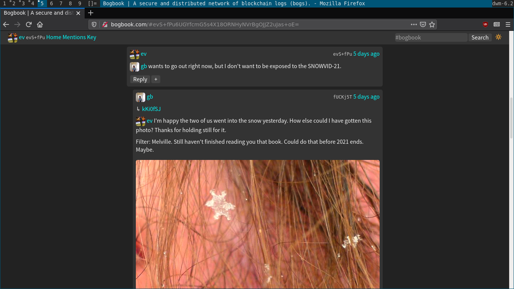

# bogbook

### by Everett Bogue


Bogbook is a distributed news network made up of feeds signed by ed25519 keypairs, and then replicated between bogbook clients in the browser and bogbook pubs. 

On bogbook you can post images with filters and posts that are rendered in markdown. You can identify your ed25519 pubkey with a name, an image, a bio, and a background.

The bogbook protocol is secure (no one can modify your posts) and the data exists in your browser, as well as any bogbook pubs you have replicated to, and all of the clients who have replicated your posts from bogbook pubs.  

+ Try it: [bogbook.com](http://bogbook.com/)
+ Electronic Mail: [ev@evbogue.com](mailto:ev@evbogue.com)
+ Public Inbox: https://lists.sr.ht/~ev/public-inbox [~ev/public-inbox@lists.sr.ht](mailto:~ev/public-inbox@lists.sr.ht)
+ IRC: irc.freenode.net #bogbook

---

### Features

+ **ed25519 keypairs**. On first load Bogbook will generate an [ed25519](http://ed25519.cr.yp.to/) [cr.yp.to] signing keypair. All of your posts will be signed with this keypair and appended to your log. To continue using the same identity make sure to visit the keys page and copy the keypair that is located there to a secure location. Example: http://bogbook.com/#key 
+ **name yourself**. Until your first post Bogbook will ask you to identify your keypair with a nickname. You can change this name at any time by posting a new `type: name` post via your profile page. Once you've added a name, consider introducing yourself here: http://bogbook.com/#M1jR2wBtUO2v+3HIa4xypc3f0+Z6YvYY2wKn/hEe/QQ=
+ **markdown text posts**. You can write messages in markdown by typing into the composer. You will see a real-time rendering of your markdown above the composer as you type. Once you are happy with your post, press 'Publish' to sign the message, append it to your log, and transmit your post to your bogbook pubs.  
+ **image posts**. You can attach one image per post. This image is by default cropped to a 680 x 680 px square and encoded using Base64. You can then apply a css filter to the image, if you choose. If the image does not look good as a square, you can uncrop the image by clicking the 'uncrop' button.
+ **profile bios**. You can choose any of your posts to show up on your profile by clicking the '+' button on the individual post, and then pressing the 'Set as bio' button.
+ **profile images**. Once you have posted an image, you can choose to use that image as your profile photo by clicking the '+' button and then pressing the 'Set as profile photo' button.
+ **profile background/banners**. Once you have posted an image, you can choose to use that image as your profile background by clicking the '+' button and then pressing the 'Set as profile background' button.
+ **feed replication**. Your signed feed exists first in your web browser. When you request feeds from Bogbook pub servers, these feeds replicate into your browser's IndexedDB where they are stored. To replicate your posts to other Bogbook pub servers, you will need to add those pubs on the key page. Example: If you're using http://bogbook.com/ your default pub will probably be `ws://bogbook.com/ws`. To add more pubs navigate to your keys page where there is a section for adding more pubs. Try adding `ws://bogbook.com/ws`, `ws://evbogue.com/ws`, and `ws://gwenbell.com/ws`. If you're running bogbook on your localhost, then your default pub will probably be `ws://localhost:8081/ws/` This adds some degree of resilience to the bogbook network, because if your default pub server goes down you can create your own or choose a new pub server.
+ **permalinks**. There is no need to replicate an entire feed to view a single message. If you do not have a message in your browser, it will reach out to your pub server and request the individual message. Example: http://evbogue.com/#upRVU8f3V18TJqDyweSckS5BiRYBXyHjBAoMQYHOWmA=  
+ **keyword search and hashtags**. Use the search input box in the top right corner to search the feeds present in your browser. You can search for keywords, phrases, or hashtags. Examples: http://bogbook.com/#?#introductions http://bogbook.com/#?bogbook -- full-text search is coming someday. Search is local-only, so pubs are not aware of searchterms.  
+ **self-moderation**. Don't like what you are hearing? Navigate to the profile page of the post author and click the 'Delete Feed' button. Upon pressing this button a sophisticated algorithm will take just a moment to delete the feed from your browser. Once the feed is deleted, you will no longer see old posts or receive new posts from the author of the feed. With bogbook, only you control the feeds that you sync into your browser. The exception to this is Bogbook pub owners. Example: If you're using Bogbook.com it will always sync the owner of that pub, which is [me](http://bogbook.com/#evS+fPu6UGYfcmG5s4X18ORNHyNVrBgOJJZ2uJas+oE=).
+ **do it yourself**. Running your own bogbook pub is as easy as cloning bogbook down to your local or virtual computer. 

---

#### Light mode/Dark mode

Toggle between light and dark modes using the brightness emoji in the top right of the navbar.




---

### Prior art

+ [old bogbook](http://git.sr.ht/~ev/oldbogbookv1) -- the protocol wasn't as optimized as I wanted, and the replication sucked
+ [ssb](http://scuttlebot.io) -- While I invested 4 years developing ssb apps, ssb was always difficult to install and the ~~`<del>`data never replicated into browsers`</del>`~~ -- actually, some progress has been made with [ssb-browser-demo](https://between-two-worlds.dk/browser.html) [repo](https://github.com/arj03/ssb-browser-demo) by arj

---

### Run it

```
git clone https://git.sr.ht/~ev/bogbook
cd bogbook
npm install
node bin
```

Navigate to http://localhost:8081/ to view your local bogbook

### use an alternative .bogbook folder

The first argument passed to node will specify a different folder to save bogs, stats, the server keypair, and config options.

```
node bin testbognet
```

Will use the `.testbognet/` folder instead of the default.

### config options

Save a `config.json` file to your `.bogbookv2` folder in order to configure your local bogbook.

#### specify your url

```
{"url": "yoururl.com"}
```

#### fortify your bog

fortify your bogs by only accepting replication requests from existing boggers. Bogbook will only respond to messages from public keys that have already published bogs to the server. This means all lurkers and new boggers will be unable to publish or replicate from the bogbook while the bog is fortified. This could be useful for a private bogging group, or for handling possible abuse cases.

```
{"fort": "true"}
```

#### customize pub announcements/welcome messages

`announcement` messages are sent to boggers who have existing feeds on the server. `welcome` messages are sent to lurkers.

```
{
  "welcome": "Hey, thanks for lurking on Bogbook",
  "announcement": "Hey, thanks for syncing your bogs to this bogbook server!"
}
```

#### change the port

you can change your bogbook port with

```
{"port": "1337"}
```

---

## bogbook v2 spec

The aim of bogbook is to be a public gossiped news and photo sharing network where you can apply filters to images. There are no private messages on the log (that became a security issue with ssb). We only encrypt/decrypt messages in transit during replication.

#### keypairs

keypairs are ed25519 keypairs, encoded in base64, concatenating the public key to private key

```
<publickey><privatekey>
```  

There can be no '/' characters in the public key, because file systems do not like slashes, so we will throw them out when generating new keypairs. If there is a '/' in an imported keypair, we should error out on import.

#### signed messages

signed messages exist on a single line, and consist of a hash of the signature, the public key of an author, and the signature

```
<sha2hash><ed25519 public key><ed25519 signature>
```

#### opened messages

when opened, it could look this way:

```
{
  text: <text>,
  seq: <sequence number>,
  author: <ed25519 public key>,
  timestamp: <Date.now()>,
  raw: <unopened message>
}
```

`timestamp` is not optional, because we need it to sort the log. 

`seq` is not optional, because we need it to sync the log.

Everything else is optional, but we should have at least `text` or an `image`. The reason we crop images to 680x680 pixels is we want the image size to be manageable for replication.

#### gossip/replication

servers and clients all have ed25519 keypairs.

opened logs are stored as 'log' and are sorted periodically by timestamp.

signed logs written by unique authors are saved as public keys. Since we're using fs on the server, we shouldn't allow public keys with a '/' because that confuses fs. 

gossip requests can contain either:

```
{
  feed: <ed25519 public key>,
  sequence: <latest sequence number we possess> 
} 
```

the response to this message will be to send one message every time the server sends us a sequence number. If we have a higher sequence number than the requester we respond with the next message in our sequence. If the server has a lower sequence number, then we respond with a gossip message sharing our latest sequence number, so that the client can instead respond to us with a replication message.

---

MIT

